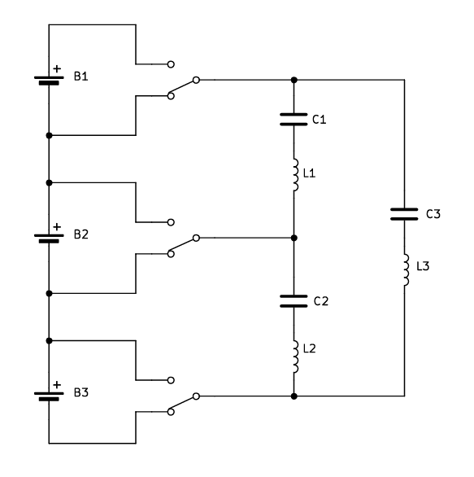
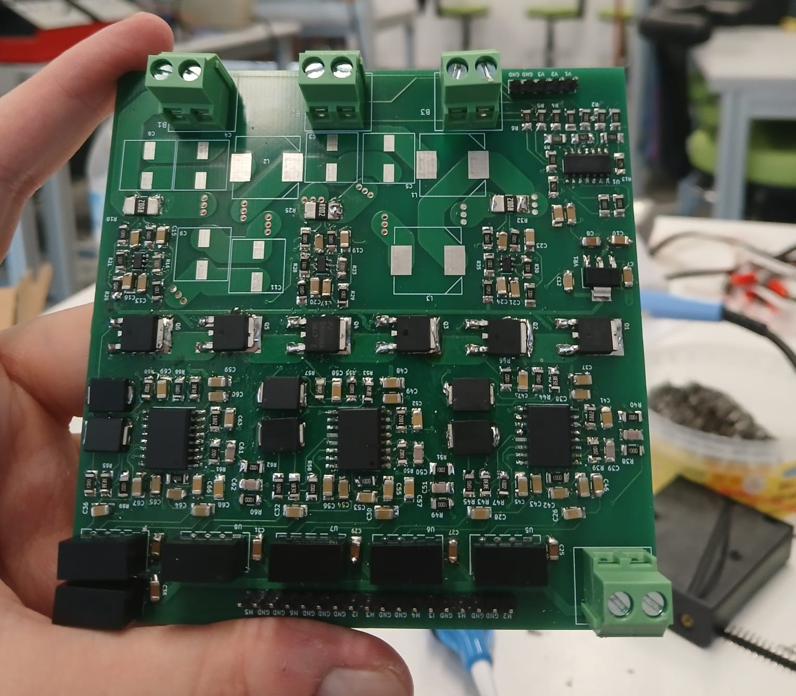

# TÜBİTAK 2209-A: Active Battery Balancing System
> This project was initiated by **Yahya Ahmet Öğütcü** under the **TÜBİTAK 2209-A University Students Research Projects Support Program**, with the primary goal of designing a novel and highly efficient active battery balancing topology. 
Following a comprehensive literature review, three distinct active balancing topologies were selected for detailed analysis and comparison: Single-Tiered Switched Capacitor, Double-Tiered Switched Capacitor, and Single-Tiered Switched Inductor. The initial phase of the project focuses on modeling and evaluating these topologies using MATLAB/Simulink.
---
## Phase 1: Simulated Topologies
### 1. Single-Tiered Switched Capacitor
This topology stands out for its simplicity in control and cost-effectiveness. However, its primary drawback is the extended balancing time, as the energy transfer rate is strictly limited by the capacity of a single capacitor moving charge only between adjacent cells.

*Figure 1: Simulink subsystem model of the Single-Tiered Switched Capacitor topology.*
### 2. Double-Tiered Switched Capacitor
To overcome the limitations of the single-tiered approach, the double-tiered topology was implemented. This architecture allows for energy transfer not just between adjacent neighbors, but also between non-adjacent cells. As a result, it significantly reduces the overall balancing time, offering a clear advantage over the single-switched method.

*Figure 2: Simulink subsystem model of the Double-Tiered Switched Capacitor topology.*
### 3. Single-Tiered Switched Inductor
The switched-inductor topology offers the fastest balancing time among the three. However, this speed comes at a cost: inductors inherently suffer from higher energy dissipation compared to capacitors. These increased energy losses can render the overall system less efficient, making thermal management and efficiency a challenge.

*Figure 3: Simulink subsystem model of the Single-Tiered Switched Inductor topology.*
---
## Phase 2: Topology Selection & Battery Modeling
Based on the preliminary analysis, the **Double-Tiered Switched Capacitor (DTSC)** topology was selected for further development due to its superior design flexibility and high potential for scalability.
Following the topology selection, research was conducted on State of Charge (SoC) and State of Health (SoH) estimation techniques. Given the high complexity of accurate SoH estimation, it was excluded from the current scope of this project. To estimate the SoC accurately, the **2nd-Order Equivalent Circuit Model (ECM)** was selected among various methods. The dynamic parameters for this model were derived from Arzu Türksoy's doctoral thesis, which enabled the creation of a highly precise battery cell model in MATLAB/Simulink.

*Figure 1: Internal current path simulation and parameters of the battery model.*
Once the accurate battery model was established, the focus shifted to the control logic of the DTSC topology. The control mechanism is intentionally straightforward but highly effective: it operates by driving the upper and lower balancing switches at a fixed **50% duty cycle**.

*Figure 2: Switch activation and alternative current path visualization.*
Finally, by integrating the advanced 2nd-order ECM battery model with the 50% duty cycle DTSC control strategy, full-scale system simulations were executed. The simulation results were then thoroughly analyzed to evaluate the balancing performance and overall energy transfer efficiency across the battery pack.

*Figure 3: The complete integrated simulation topology in Simulink.*
---
## Phase 3: Quasi-Resonant Topology & Prototyping
To more easily determine the optimal switching frequency of the DTSC topology, minimize switching losses, and maximize energy transfer efficiency, inductors were added in series with the capacitors. This modification upgrades the design into a **Quasi-Resonant Double-Tiered Switched Capacitor** topology.

*Figure 1: Architecture of the Quasi-Resonant Double-Tiered Switched Capacitor.*
After determining the optimal circuit parameters, the system was simulated for a highly unbalanced scenario where the initial states were **SoC1 > SoC2 > SoC3**. The resulting balancing waveforms successfully demonstrate the dynamic energy transfer between the cells.

*Figure 2: Scope outputs showing successful energy transfer and cell balancing over time.*
Because the system operates at a high switching frequency of **50 kHz**, simulating the entire balancing process until full convergence required excessive computational time in Simulink. To resolve this bottleneck, average balancing current data for various SoC states were extracted, and a **reduced-order mathematical model** was designed utilizing data interpolation.

*Figure 3: Derivation of the reduced-order mathematical model via interpolation.*
Using this reduced-order model, the total balancing time could be calculated rapidly and accurately through pure mathematical computations, bypassing the need to simulate the high-frequency switching dynamics over long periods. The projected total balancing time is illustrated below.

*Figure 4: Total calculated balancing time required for full cell convergence.*
Finally, based on the validated simulation models, the physical prototype of the active balancing circuit was designed and routed using **KiCad**, paving the way for hardware manufacturing and real-world experimental testing.

*Figure 5: Final PCB layout and prototype design rendered in KiCad.*
